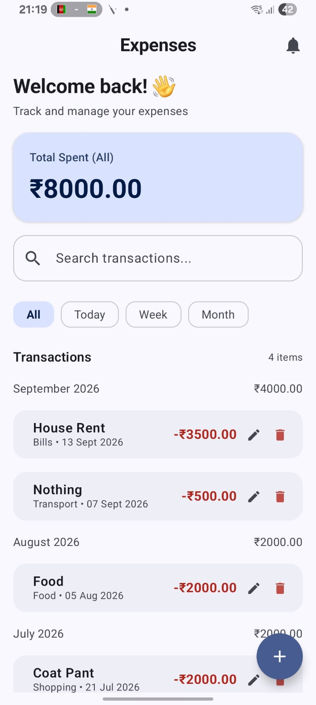
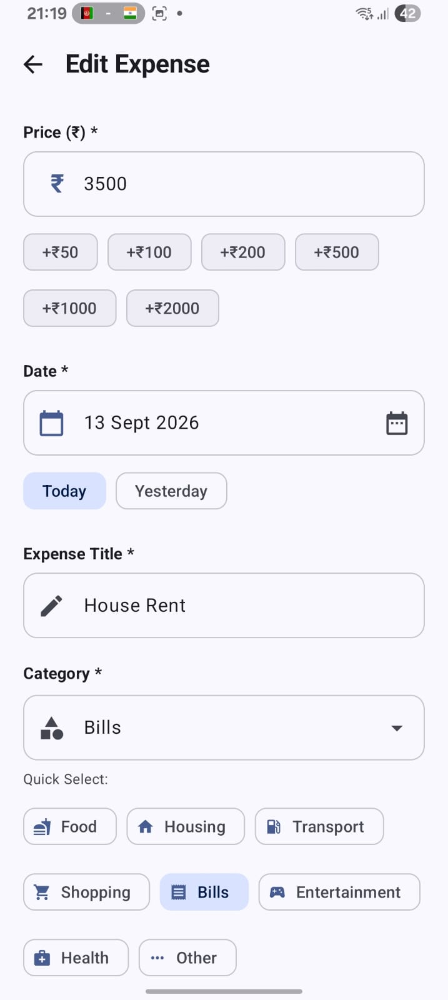
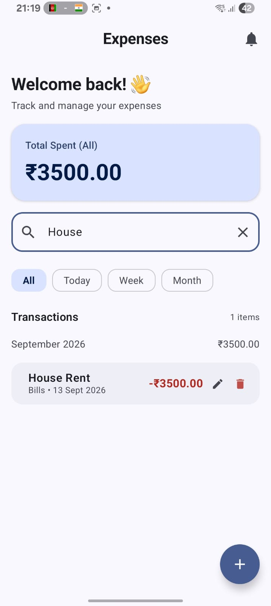

# Expense Tracker

An Android application for tracking and managing daily expenses.

## Features

- Add expenses
- Edit expenses
- Delete expenses
- Select expense categories
- Select expense dates
- Search transactions
- Filter by Today, Week, and Month
- View total spending
- Group transactions by month
- Store expenses locally using Room Database

## Screenshots

<table>
  <tr>
    <td align="center">
      <b>Home Screen</b> 
      
    </td>
    <td align="center">
      <b>Edit Expense</b> 
      
    </td>
    <td align="center">
      <b>Search Transactions</b> 
      
    </td>
  </tr>
</table>

## Tech Stack

- Kotlin
- Jetpack Compose
- Material 3
- Room Database
- MVVM Architecture
- Navigation Component
